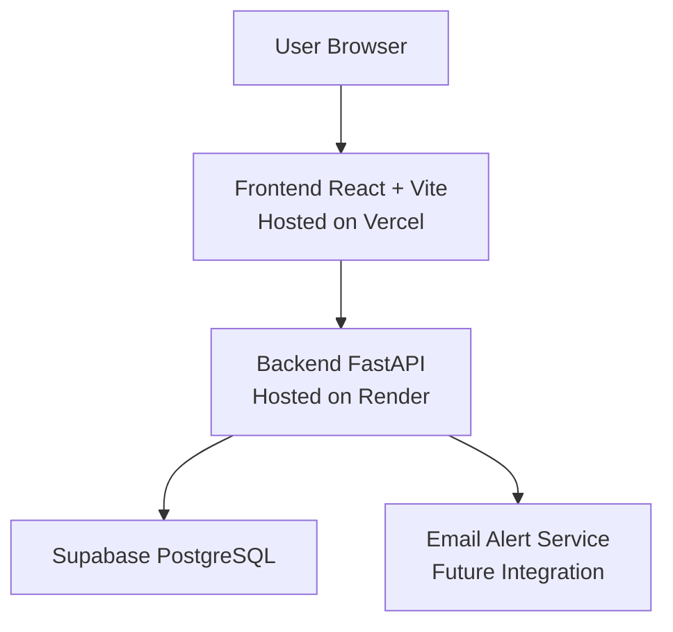

## 🌊 Ecopulse

## Overview

Ecopulse is a web based flood risk awareness and early warning platform designed for flood prone communities across Africa.

The platform translates complex climate and flood related data into simple, location specific guidance that residents and small and medium sized enterprises can use to prepare ahead of time.

By simplifying risk information and enabling early alert subscriptions, Ecopulse promotes proactive disaster preparedness rather than reactive response.

## Problem Context

Flooding remains one of the most frequent and destructive climate related hazards across many African regions. Although climate and weather data exists, communities often receive information that is:

* Late

* Too technical

* Not location specific

* Not actionable

This results in avoidable consequences such as:

* Property damage

* Business interruption

* Income loss

* Displacement

* Increased safety risks

Ecopulse bridges the gap between climate data availability and practical, community level action.

## Solution Summary

Ecopulse provides:

* Location based flood risk summaries

* Plain language explanations of risk levels

* Email subscription for early flood alerts

* A scalable backend API for risk processing

The focus of this MVP is to make flood preparedness accessible, understandable, and actionable.

## SDG Alignment

SDG 13: Climate Action

Ecopulse contributes by:

* Enhancing adaptive capacity to climate related hazards

* Supporting early preparedness and awareness

* Encouraging informed decision making before disasters occur

## Technical Architecture

## Live Backend URL
https://ecopulse-ndki.onrender.com/

Swagger Documentation:
https://ecopulse-ndki.onrender.com/docs

## Backend API Endpoints

# GET /health

- Checks whether the backend service is running.

Example response:

{
  "status": "ok"
}

# GET /risk?location=CityName

- Returns a flood risk summary for a specified location.

Example:

/risk?location=Lagos

Example response:

{
  "location": "Lagos",
  "risk_level": "Moderate",
  "message": "Flood risk in Lagos is moderate."
}

# POST /subscribe

- Registers a user email and location for early flood alerts.

Parameters:

* email

* location

Example response:

{
  "message": "Subscription successful",
  "data": [...]
}

# Database Schema

Table: subscribers

Fields:

- id (UUID, primary key)

- email (unique, not null)

- location (text)

- created_at (timestamp)

- alert_enabled (boolean)

## Local Development (Backend)

1. Clone the repository

2. Navigate to backend directory

3. Create and activate virtual environment

python3 -m venv venv
source venv/bin/activate

4. Install dependencies

pip install -r requirements.txt

5. Create a .env file with:

SUPABASE_URL=your_project_url
SUPABASE_KEY=your_service_role_key

6. Run the server

uvicorn app.main:app --reload

7. Open

http://127.0.0.1:8000/docs

## Project Status

* Backend API deployed and operational

* Supabase database integration complete

* CORS enabled for frontend integration

* Frontend integration in progress

* Email automation pending

* Real time flood data integration pending

