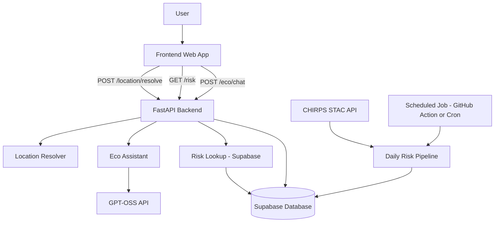

## 🌊 Ecopulse

## Overview

Ecopulse is a web-based flood risk awareness and early warning platform designed for flood-prone communities across Africa.

The platform translates rainfall and climate data into simple, location-specific preparedness guidance that residents and small and medium-sized enterprises (SMEs) can use to take proactive action.

Rather than predicting floods in real time, Ecopulse converts existing rainfall indicators into understandable regional risk levels that support early awareness and preparedness.

## Problem Context

Flooding remains one of the most frequent and destructive climate-related hazards across many African regions. Although rainfall and climate datasets exist, communities often receive information that is:

* Late

* Too technical

* Not location specific

* Not actionable

This results in avoidable consequences such as:

* Property damage

* Business interruption

* Income loss

* Displacement

* Increased safety risks

Ecopulse bridges the gap between climate data availability and practical, community level action.


## Solution Summary

Ecopulse provides:

* Location-based flood risk summaries at the ADM2 (regional) level

* Deterministic rainfall-based flood risk classification

* Plain-language explanations via the ECO assistant

* Email subscription for early flood alerts

* A scalable backend API for risk processing and integration

The MVP focuses on accessibility, transparency, and explainability — not complex predictive modeling.


## 🌧 Deterministic Risk Engine (MVP Design)

Ecopulse uses a rainfall-based flood risk proxy powered by CHIRPS Daily rainfall data from Digital Earth Africa.

For the MVP:

* Risk Score = Recent Rainfall / Historical Mean Rainfall

* Risk classification is rule-based (no machine learning)

* Same input always produces the same output (deterministic logic)


Risk categories:

* Low

* Moderate

* High

* Unknown (if rainfall data is missing)


This approach ensures:

* Transparency

* Reproducibility

* Fast execution

* Clear interpretability


## 📊 Data Sources

* CHIRPS Daily Rainfall Dataset (Digital Earth Africa STAC API)

* geoBoundaries ADM2 Administrative Boundaries (Africa subset)

Ecopulse does not generate new climate predictions. It translates publicly available rainfall indicators into structured preparedness insights.


## ⚠ Disclaimer

Ecopulse does not predict floods in real time and does not coordinate emergency response.

The platform translates rainfall-based indicators into simplified regional preparedness guidance.

Risk levels are rainfall-based proxies and should not be interpreted as official emergency warnings.


## SDG Alignment

SDG 13: Climate Action

Ecopulse contributes by:

* Enhancing adaptive capacity to climate related hazards

* Supporting early preparedness and awareness

* Encouraging informed decision-making before disasters occur


## 🏗 Architecture Overview 

Ecopulse is structured into three main layers:

- **Frontend Layer** – User interface for location search, map visualization, alerts, and ECO assistant.
- **Backend API Layer** – FastAPI service responsible for location resolution, risk lookup, and AI explanations.
- **Data Intelligence Layer** – Deterministic rainfall-based flood risk engine powered by CHIRPS data.

The diagram below illustrates how these components interact:



### 🔄 End-to-End Flow

1. The user interacts with the frontend (searching a location or asking ECO a question).
2. The frontend calls the backend API:
   - `/location/resolve` → maps user input to a stable `region_id`.
   - `/risk` → retrieves the latest daily risk metrics.
   - `/eco/chat` → generates a contextual preparedness explanation.
3. The backend retrieves precomputed risk data from Supabase.
4. The ECO assistant calls GPT-OSS to convert deterministic risk metrics into natural language guidance.
5. A scheduled daily pipeline processes CHIRPS rainfall data and updates regional risk records.


## Live Backend URL
https://ecopulse-ndki.onrender.com/

Swagger Documentation:
https://ecopulse-ndki.onrender.com/docs


## Backend API Endpoints

# GET /health

- Checks whether the backend service is running.

Example response:

```bash
{
  "status": "ok"
}
```

# GET /risk?location=CityName

- Returns a flood risk summary for a specified location.

Example:

/risk?location=Lagos

Example response:

```bash
{
  "location": "Lagos",
  "risk_level": "Moderate",
  "message": "Flood risk in Lagos is moderate."
}
```

# POST /location/resolve

Maps user input to a stable ADM2 region_id.

Request Body:

```bash
{
  "country": "Nigeria",
  "user_location": "Ikeja"
}
```

Response:

```bash
{
  "region_id": "NG-LA-IKJ",
  "region_name": "Ikeja",
  "country": "Nigeria"
}
```


GET /risk?region_id=NG-LA-IKJ

Returns the latest deterministic rainfall-based risk record for a region.

Example response:

```bash
{
  "region_id": "NG-LA-IKJ",
  "country": "Nigeria",
  "adm2_name": "Ikeja",
  "valid_at": "2026-02-12",
  "rainfall_index": 0.78,
  "anomaly": 1.2,
  "rainfall_percentile": 85,
  "risk_level": "Moderate",
  "data_quality": "ok"
}
```

POST /eco/chat

Generates a contextual preparedness explanation.

Request Body:

```bash
{
  "region_id": "NG-LA-IKJ",
  "message": "Should I be worried about flooding today?"
}
```

POST /subscribe

Registers a user for flood alert notifications.

DELETE /unsubscribe

Disables alert notifications for a subscribed email.

## Database Schema

# Table: risk_adm2_daily

* region_id (primary key)

* country

* adm2_name

* valid_at

* rainfall_index

* anomaly

* rainfall_percentile

* risk_level

* data_quality


# Table: subscribers

* id (UUID)

* email (unique)

* country

* region

* region_id

* alert_enabled

* severe_alerts

* early_alerts

* preparedness_reminders

* email_delivery

* in_app_delivery

* browser_delivery

* created_at


## Local Development (Backend)

1. Clone the repository

2. Navigate to backend directory

3. Create and activate virtual environment

```bash
python3 -m venv venv
source venv/bin/activate
```

4. Install dependencies

```bash
pip install -r requirements.txt
```

5. Create a .env file with:

```bash

SUPABASE_URL=your_project_url
SUPABASE_SERVICE_ROLE_KEY=your_service_role_key
GPT_OSS_BASE_URL=your_llm_gateway_url
GPT_OSS_API_KEY=your_api_key
GPT_OSS_MODEL=gpt-oss-120gb

```

6. Run the server

```bash
uvicorn app.main:app --reload
```

7. Open

http://127.0.0.1:8000/docs


## Project Status

* Backend API deployed and operational

* Supabase integration complete

* Deterministic rainfall-based risk engine integrated

* Location resolution via ADM2 mapping

* ECO assistant integration in progress

* Daily automated risk pipeline pending final integration


